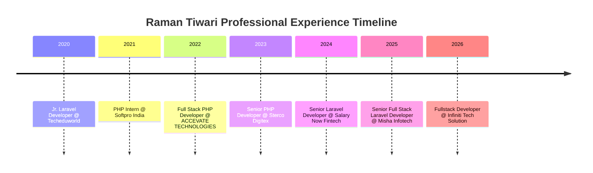

<!-- ================================================================= -->
<!-- 🚀 REVATIRAMAN TIWARI (RAMAN TIWARI) — GITHUB PROFILE README        -->
<!-- SEO Optimized for: Senior Laravel Developer, Full Stack Engineer,  -->
<!-- Agentic AI, PHP, React, MySQL, AWS & Enterprise Software Systems   -->
<!-- ================================================================= -->

<div align="center">

  <!-- Dynamic Animated Hero Wave -->
  <a href="https://www.linkedin.com/in/raman-tiwari/">
    
  </a>

  <!-- Animated Typing SVG for Core Skills & Experience -->
  <a href="https://www.linkedin.com/in/raman-tiwari/">
    
  </a>

  <br/>

  <!-- Interactive Social & Contact Badges -->
  <p align="center">
    <a href="https://www.linkedin.com/in/raman-tiwari/" target="_blank">
      
    </a>
    <a href="mailto:ramantiwari644@gmail.com">
      
    </a>
    <a href="tel:+919580980177">
      
    </a>
    <a href="https://github.com/rramantiwari">
      
    </a>
    
  </p>

  <!-- Availability & Status Pills -->
  <p align="center">
    
    
    
    
  </p>

</div>

---

<!-- ================================================================= -->
<!-- 🔍 SEO & SEARCH ENGINE KNOWLEDGE GRAPH BINDING                   -->
<!-- ================================================================= -->
<details open>
<summary><b>📌 Executive Overview & Identity Resolution</b></summary>

> **Revatiraman Tiwari**, popularly known as **Raman Tiwari**, is an industry-tested **Senior Full Stack Developer and Laravel Architect** with **6+ years of professional engineering experience**. Based in Noida, India, he currently builds high-velocity platforms at **Infiniti Tech Solution**. His core specialization spans **PHP 8+, Laravel, MySQL, PostgreSQL, CockroachDB, Redis, React.js, React Native, TypeScript, AWS, RESTful Microservices, and Agentic AI workflow integration**.
>
> **Identity Statement:** *Revatiraman Tiwari and Raman Tiwari refer to the same individual and software engineering identity.*
</details>

---

## ⚡ Key Engineering Highlights & Scale

```text
  ┌─────────────────────────────────────────────────────────────────────────────┐
  │ 🚀 ORF Online Platform   │ Redis caching for 10K+ posts & 1M+ users (2-3s speedup)
  │ 💳 Salary Now Fintech    │ Asynchronous queue-based loan engine for 100+ agents 
  │ ⌚ Cooke & Kelvey        │ Luxury watch retailer platform (Rolex & Tudor)
  │ 🍔 Food Angels (Germany) │ Gourmet e-commerce with automated PayPal checkouts
  │ 🎓 Manav Rachna Univ.    │ Centralized multi-campus CMS engine (CodeIgniter 4)
  │ 🤖 Agentic AI Workflows  │ LLM tool-calling & autonomous task pipelines in PHP/Node
  └─────────────────────────────────────────────────────────────────────────────┘
```

- 🔭 **Currently Building:** Full-stack enterprise web and mobile applications at **[Infiniti Tech Solution](https://www.infinititechsolution.com/)**
- 🏛️ **Architecture Philosophy:** Clean architecture, decoupled domains, and queue-driven scalability beat clever hacks
- 🎯 **TestDome Verified:** Scored in the **Top 25% globally** on the [TestDome Laravel Certification Exam](https://www.testdome.com/certificates/32221773dd3a440d904278906171c143)
- 📊 **GitHub Activity:** **1,400+ contributions** in the past year across production web applications, open-source packages, and microservice APIs

---

## 🛠️ Technology Stack & Skills Matrix

<div align="center">

  <!-- Interactive Skill Icons Strip -->
  
  <br/>
  

</div>

<br/>

| Domain | Technologies & Frameworks |
| :--- | :--- |
| **Backend Engineering** | **PHP 8+, Laravel (8/9/10/11), CodeIgniter (3/4), Node.js, Express.js** |
| **Frontend & Mobile** | **React.js, React Native, Next.js, TypeScript, JavaScript (ES6+), Redux, Zustand** |
| **Databases & Caching** | **MySQL, MariaDB, PostgreSQL, CockroachDB (Distributed SQL), Redis In-Memory Cache** |
| **Cloud & DevOps** | **AWS (EC2, RDS, S3, IAM), Linux / Ubuntu Server, Nginx, Docker, Jenkins CI/CD, Git** |
| **AI & Automation** | **Agentic AI, OpenAI / Gemini API, LLM Tool Calling, Robotic Process Automation (UiPath)** |
| **API & Architecture** | **RESTful Microservices, GraphQL, WebSockets, MVC / HMVC, Event Listeners & Queue Workers** |
| **Styling & Design** | **Tailwind CSS, Bootstrap (4/5), Modern Vanilla CSS, Material UI, UI/UX Systems** |

---

## 💼 Professional Career Journey



### 1. [Infiniti Tech Solution](https://www.infinititechsolution.com/) — Fullstack Developer
*🗓️ September 2026 – Present · Noida, Uttar Pradesh, India*
- Architecting and shipping robust full-stack web and mobile systems for enterprise clients across SaaS, Healthcare, E-Commerce, and Fintech.
- Designing high-concurrency Laravel and Node.js backends with resilient API gateways and reactive frontends.

### 2. Misha Infotech Pvt Ltd — Senior Full Stack Laravel Developer
*🗓️ May 2025 – August 2026 · Noida, Uttar Pradesh, India*
- Spearheaded enterprise application architecture for SaaS and ERP client products.
- Pioneered Agentic AI workflows to automate internal business pipelines and client features.
- Engineered modern web experiences with React.js, React Native, and TypeScript.

### 3. Salary Now Fintech — Senior Laravel Developer
*🗓️ November 2024 – May 2025 · Noida / Delhi NCR, India*
- Designed and deployed an asynchronous **Queue-Based Loan Pool Module** handling multi-stage underwriting for **100+ loan officers**.
- Automated transactional email confirmations via a custom secure IMAP parsing pipeline.

### 4. Sterco Digitex Pvt Limited — Senior PHP Developer
*🗓️ August 2023 – November 2024 · Noida, Uttar Pradesh, India*
- Engineered high-traffic caching for **ORF Online (10K+ posts & 1M+ active users)** using Redis, slashing load times by **2–3 seconds**.
- Standardized reusable Laravel Traits and Blade design components across development squads.

### 5. ACCEVATE TECHNOLOGIES — PHP Developer
*🗓️ February 2022 – August 2023 · Noida, Uttar Pradesh, India*
- Built bespoke MVC/HMVC platforms and optimized heavy SQL queries for reporting backends.

### 6. Earlier Experience
- **Techeduworld Technology** (*Jul 2020 – Feb 2022*): Built EdTech LMS and assessment portals with Stripe/PayPal payment integrations.
- **Softpro India Computer Technologies** (*Aug 2021 – Jan 2022*): Core PHP development, database normalization, and frontend integration.

---

## 🏆 Verified Credentials & Certifications

<div align="center">

| Certificate / Credential | Issuing Authority | Verification Status |
| :--- | :--- | :--- |
| 🥇 **Laravel Developer — Top 25% Ranking** | **TestDome** | [Verified Credential](https://www.testdome.com/certificates/32221773dd3a440d904278906171c143) |
| 🐍 **Applied Data Science with Python (Level 2)** | **IBM / Cognitive Class** | [Verify on Credly](https://www.credly.com/go/gumWo2pj) |
| 🗄️ **Distributed SQL & CockroachDB** | **Cockroach Labs** | Verified Certificate |
| 🐘 **PHP with Laravel (Grade A+)** | **Softpro India / POLYPREP** | Cert `SPI/VT/2021/112` |
| 📱 **Android Mobile Certification** | **Google / Android** | Signed by VP Android Engineering |
| 💻 **Python (Basic) Assessment** | **HackerRank** | Cert `41510FD44198` |
| ☕ **Java (Basic) Assessment** | **HackerRank** | Cert `3D178367D80D` |
| 📈 **Growth-Driven Design** | **HubSpot Academy** | Cert `7b2dc2c1fc5f464eb18a4fff73645028` |
| 🌐 **Fundamentals of Digital Marketing** | **Google Digital Unlocked / IAB** | Cert `DL5 2LA 38E` |
| 📊 **Google Analytics for Beginners** | **Google Analytics Academy** | Verified Course Completion |
| 🤖 **Robotic Process Automation (RPA)** | **UiPath** | Verified Automation Specialist |

</div>

---

## 📊 Live GitHub Analytics & Performance

<div align="center">

  <!-- GitHub Streak Stats -->
  <a href="https://github.com/rramantiwari">
    
  </a>
  
  <!-- GitHub Profile Stats -->
  <a href="https://github.com/rramantiwari">
    
  </a>

  <br/>

  <!-- Top Languages -->
  <a href="https://github.com/rramantiwari">
    
  </a>

</div>

---

## 🌟 Featured Public Projects & Repositories

| Repository | Tech Stack | Highlights |
| :--- | :--- | :--- |
| 📌 **[OSQR Attendance System](https://github.com/rramantiwari/OSQR-Attendace_System_By_QR_Code)** | PHP 8, JS, Ajax, Bootstrap | Dynamic session-based QR code generation for fraud-free real-time attendance. |
| 💼 **[Digital HR Platform](https://github.com/rramantiwari/Digital_HR)** | JavaScript, PHP, MySQL | Computerized organizational human resource management system. |
| 📱 **[React Native Portfolio](https://github.com/rramantiwari/React-Native-Portfolio)** | TypeScript, React Native | Cross-platform mobile portfolio app with native animations. |
| 💰 **[Consumer Loan Assistant](https://github.com/rramantiwari/consumerloanassistant)** | Java, Financial Engines | Precision loan amortization and consumer credit computation engine. |
| 📚 **[TechBook](https://github.com/rramantiwari/TechBook)** | HTML5, Modern CSS, JS | Modern interactive technical documentation and knowledge base template. |

---

## 📬 Let's Connect & Collaborate

<div align="center">

  **Open to high-impact Senior Full Stack, Laravel, and Agentic AI engineering opportunities.**

  <br/>

  <a href="https://www.linkedin.com/in/raman-tiwari/">
    
  </a>
  &nbsp;
  <a href="mailto:ramantiwari644@gmail.com">
    
  </a>
  &nbsp;
  <a href="tel:+919580980177">
    
  </a>

  <br/><br/>

  <!-- Animated Footer Wave -->
  <a href="https://github.com/rramantiwari">
    
  </a>

  <sub>Designed with precision for <b>Revatiraman Tiwari (Raman Tiwari)</b> · <i>Clean architecture beats clever hacks.</i></sub>

</div>
